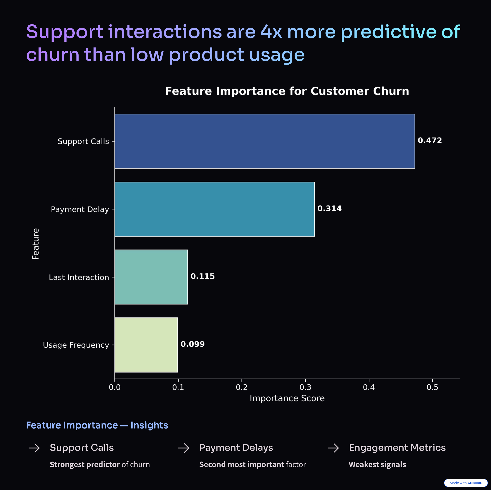

📫 **Contact:** [LinkedIn](https://www.linkedin.com/in/YOUR_PROFILE) | [GitHub](https://github.com/Fer-Ramirez) | ✉️ fer.ramirezm4@gmail.com

Analytical leader with a PhD in Biomedical Sciences and experience as an Account Director in the Pharma sector. I specialize in transforming operational data into revenue-driving strategies.

---

## Driving Revenue & Retention Through Data

**Quantified $162M in revenue risk and uncovered operational drivers of customer churn using predictive analytics.**

---

## Featured Case Studies

**Key Project**
### 📊 Strategic Retention Audit: Revenue Risk & Operational Levers

**Identified $162M in revenue exposure and uncovered operational friction as the primary churn driver.**

- **Business Impact:** High-value customers concentrated in unstable contract segments  
- **Key Insight:** Support interactions are the strongest predictor of churn (Feature Importance: 0.47)  
- **Action Plan:** Support RCA, contract migration strategy, predictive churn alerts  

**Tech:** Python (Scikit-learn), SQL (DuckDB), Revenue Analytics  

[Explore Analysis](https://github.com/Fer-Ramirez/customer-churn-operations-analytics) | [Executive Summary](https://raw.githubusercontent.com/Fer-Ramirez/customer-churn-operations-analytics/main/Presentation/churn_analysis_slides.pdf)

 

Support interactions are the strongest predictor of churn, driving nearly 50% of model importance.

---

### 💊 [PREVIEW] Pharma Supply Chain: Lead-Time Optimization
*Optimizing the 'Cold Chain' for global health logistics.*

* **Context:** Analyzing delivery delays in life-saving medication to prevent spoilage and stock-outs.
* **Action:** Implementing **SQL Window Functions** to audit vendor performance across international routes.
* **Status:** Phase 1: Diagnostic SQL Audit in progress.
  
---

## Technical Toolkit

- **Data & Modeling:** Python (Pandas, Scikit-learn), SQL (DuckDB, PostgreSQL)  
- **Analytics:** Revenue Analysis, Churn Modeling, KPI Design  
- **Visualization:** Power BI, Tableau, Seaborn  
- **Domain:** Pharma Operations, Customer Analytics  

---

## 📫 Open to Opportunities

- [LinkedIn](https://www.linkedin.com/in/YOUR_PROFILE)  
- [GitHub](https://github.com/Fer-Ramirez)  
- ✉️ fer.ramirezm4@gmail.com
