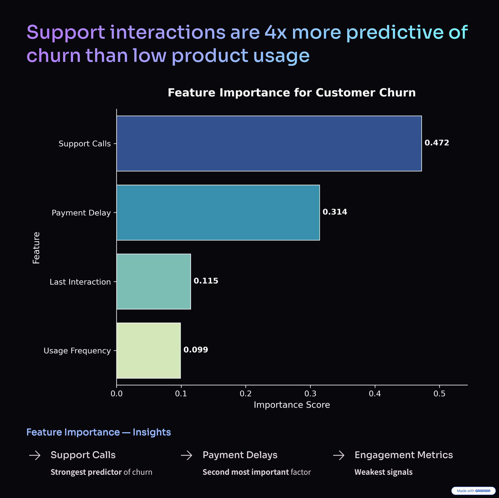

**Contact:** <a href="https://www.linkedin.com/in/TU_PERFIL">LinkedIn</a> | <a href="https://github.com/Fer-Ramirez">GitHub</a> | fer.ramirezm4@gmail.com

## About Me

> **BI & Operations Analyst** with a PhD in Biomedical Sciences and experience in the pharmaceutical industry, including client-facing and cross-functional roles.
> 
> My research background trained me to approach complex problems with **structured thinking** and to translate data into **clear, evidence-based narratives**.
> 
> In industry, I’ve worked closely with stakeholders across functions, developing the ability to communicate insights, align teams, and connect data analysis with business decisions. I apply this foundation with **SQL, Python, and Predictive Analytics** to drive revenue-focused and operational insights.

---

## Driving Revenue & Retention Through Data

**Quantified $162M in revenue risk and uncovered operational drivers of customer churn using predictive analytics.**

---

## Featured Case Studies

**Key Project**

### 📊 RappiPlus — Business Performance Analysis

**Full-funnel analysis of revenue, conversion, retention, and A/B testing across a Latin American e-commerce platform.**

- **Business Impact:** Identified a single payment friction point costing `13.3%` of ready-to-buy users — with an estimated `~$120K` revenue impact per cohort.
- **Key Insight:** All three channels deliver identical ROAS (`3.49x`–`3.73x`) and funnel behavior — paid spend efficiency is confirmed, but incrementality is not.
- **Action Plan:** Payment UX fix, incrementality test, purchase-level cohort instrumentation.

**Tech:** Python, SQL (pandasql), Tableau Public, Statistical Testing (Z-test)

| [Explore Full Analysis](https://github.com/Fer-Ramirez/rappiplus-business-performance-analysis) | [View Interactive Dashboard](https://public.tableau.com/views/RappiPlusBusinessPerformanceAnalysis/Historia1) |
| --- | --- |

*From Revenue to Retention: a 3-page interactive dashboard built for executive stakeholders.*

---

### 📊 Strategic Retention Audit: Revenue Risk & Operational Levers

**Identified $162M in revenue exposure and uncovered operational friction as the primary churn driver.**

- **Business Impact:** High-value customers concentrated in unstable contract segments.
- **Key Insight:** Support interactions are the strongest predictor of churn (Feature Importance: 0.47).
- **Action Plan:** Support RCA, contract migration strategy, predictive churn alerts.

**Tech:** Python (Scikit-learn), SQL (DuckDB), Revenue Analytics

| [Explore Full Analysis](https://github.com/Fer-Ramirez/customer-churn-operations-analytics) | [Download Executive Summary](https://raw.githubusercontent.com/Fer-Ramirez/customer-churn-operations-analytics/main/Presentation/churn_analysis_slides.pdf) |
| --- | --- |

 

Support interactions are the strongest predictor of churn, driving nearly 50% of model importance.

---

### 💊 [IN DEVELOPMENT] Pharma Supply Chain: Strategic Operational Audit
*Optimizing the 'Clinical-Commercial Nexus' in Global Health Logistics.*

**The Business Case:**
In the high-stakes ARV market, a 10-day delay triggers a "Treatment Interruption" risk. This leads to **permanent market share loss** as patients migrate to competitor second-line therapies, alongside direct losses from **Inventory Obsolescence**.

**Strategic Research Questions:**
1. **Operational:** Which vendors are "Chronic Delayers" exceeding the 10% safety buffer?
2. **Financial:** What is the **Inventory Value-at-Risk** due to shelf-life loss during transit?
3. **Clinical:** What is the projected revenue loss if a delay triggers a 5% patient switch to second-line therapy?

**The Analysis Roadmap:**
* **Advanced SQL Audit:** Ranking carrier reliability and "Cost-of-Delay" logic.
* **Inventory Obsolescence:** Quantifying "Expiry Velocity" and shelf-life degradation.
* **Simulation:** "What-If" engine for 2026 freight inflation and ROI of route optimization.
* **PhD Edge:** Modeling the Clinical-Commercial impact of Treatment Interruption.

*Project Status: Phase 1 (Data Schema & SQL Diagnostic) in progress.*
  
---

## Technical Toolkit

  <strong>Data & Modeling</strong>

  PYTHON
  PANDAS
  SCIKIT-LEARN
  SQL

  <strong>Analytics</strong>

  REVENUE ANALYSIS
  CHURN MODELING
  KPI DESIGN

  <strong>Visualization</strong>

  POWER BI
  TABLEAU
  SEABORN

  <strong>Domain</strong>

  PHARMA OPERATIONS
  CUSTOMER ANALYTICS

---

## 📫 Open to Opportunities

<a href="https://www.linkedin.com/in/TU_PERFIL">LinkedIn</a> | <a href="https://github.com/Fer-Ramirez">GitHub</a> | fer.ramirezm4@gmail.com
